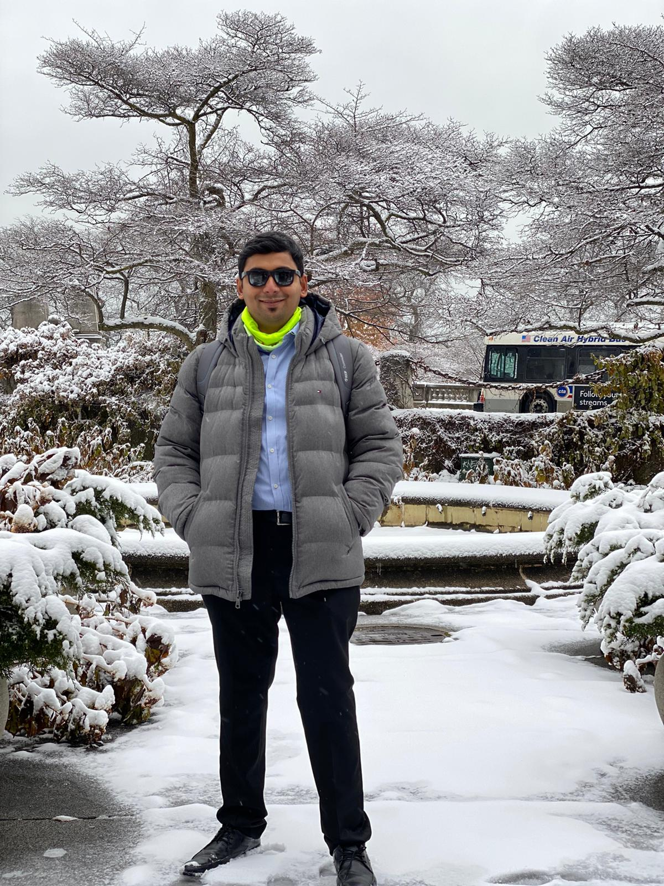
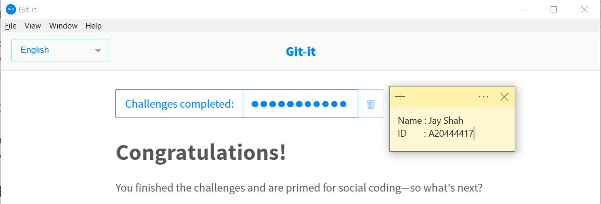
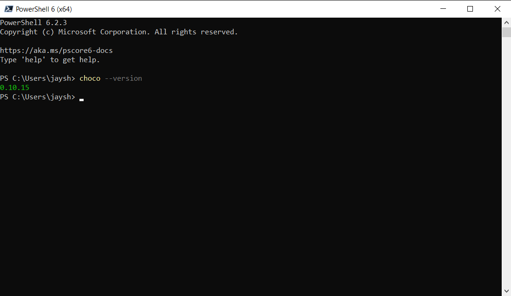
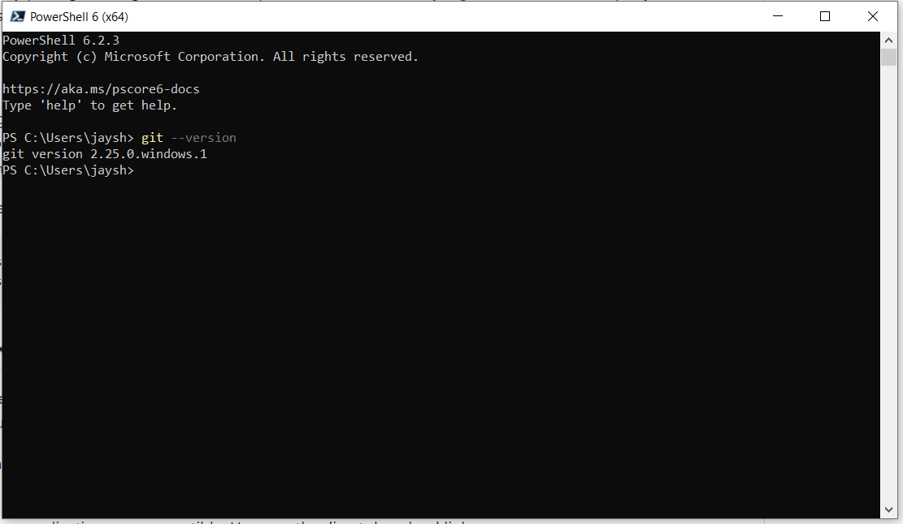
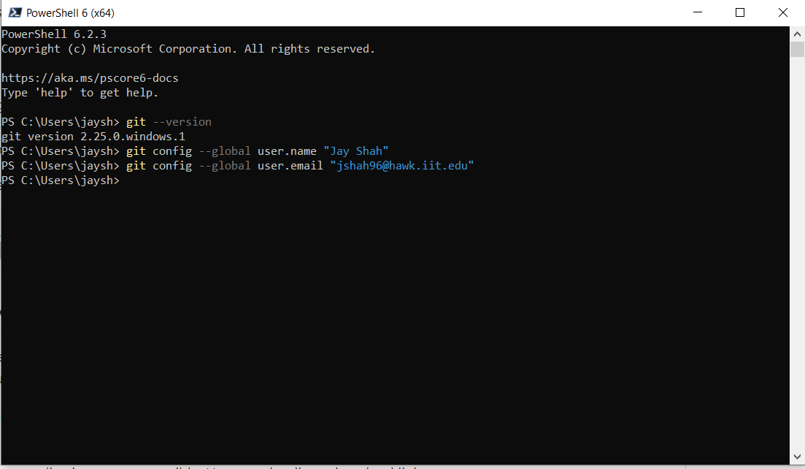
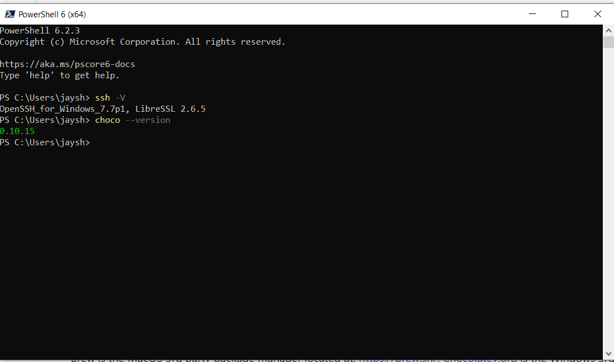
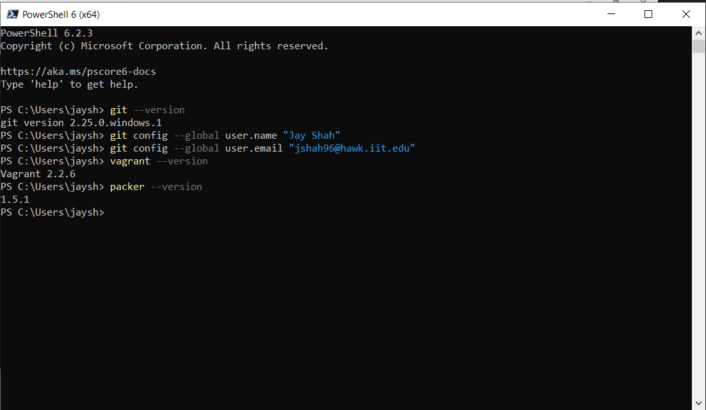
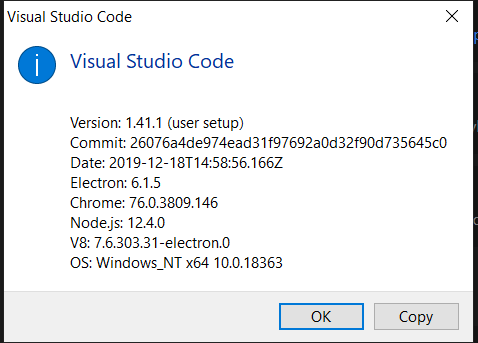

# Jay Shah

## Where are you from?

I am from India, to be specific "Mumbai" known to be "The city that never sleeps".

## IT Interest

I pursued my bachelors in Information Technology from Mumbai university. I worked as Software Engineer for 3 years in order to sense industrial experience.I am inclined towards ERP systems and worked in CRM projects during my work tenure.Later, I had dream to conquer and hence started on with my Master's in United States. 

## Something Interesting About You
I am sports freak, especially cricket.I watch as well as play the game.
Also fond of indoor sports like chess,carrom where i excelled during my high-school.I also like travelling and exploring new places.

## Git-IT Tutorial Badge

## Tutorial Screenshots

